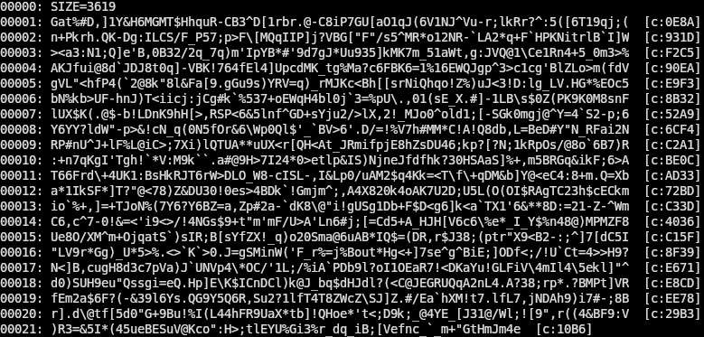

# PaperROM



**PaperROM** is a minimalist, mythotechnic system for preserving digital code on paper in the most durable, long-lasting, and easy to obtain medium available: Tyvek paper.

This toolchain allows you to compress any file, encode it in Base85 with checksum-verified lines, and print it as plain text to rugged paper like Tyvek. The result is a bootable scroll — readable by machine or human, restorable even after collapse, and durable enough to last centuries.

We are inspired by punchcards which while well before our time is a charming blend of compute and physicality. You could print and stack a bunch and seal them for future-proofing, or in our envisioning form a scroll that is then sealed able to last hundred plus years kept well. This is experimental and we are waiting for a new printer and Tyvek sheets to come, likely inkjet printers will need careful use to avoid smudging on the Tyvek and should be left to dry overnight.

---

## Features

- Compresses files using zlib (Deflate)
- Encodes to printable ASCII Base85
- Adds line numbers and CRC16 checksum fragments
- Produces a readable `.txt` scroll
- Decodes back into the original file with full integrity

---

## Philosophy

Digital media decays. Hard drives fail. The cloud dies when the grid does.

**PaperROM** is a sacred backup. A way to preserve what matters — code, scripture, instruction, ritual logic — in a form that:

- Can be **read by eye**
- Survives **fire, water, and time** when printed on Tyvek
- Is usable by **low-tech computers and OCR**
- Bridges the worlds of **ritual and machine**

---

## Recommended Print Medium: Tyvek

To maximize durability:

- Use **printable Tyvek sheets** (such as Tyvek 8740D or 1056D)
- Compatible with most **laser printers** and some **pigment-based inkjets**
- Standard size: 8.5x11", or tile multiple for scroll construction
- Let ink dry thoroughly before rolling or binding

**Tip:** Stitch or tape multiple sheets for long scrolls. Store in a cedar tube, mylar sleeve, or watertight container.

---

## Usage

### Encode a File
```
./scroll_encoder input_file output_scroll.txt
```

This compresses and encodes your file into a scroll-style text file with line numbers and hash fragments.

### Print file

Simply print the exported file to your printer with Tyvek sheets ready and store.


### Decode a Scroll
Utilize a scanner, take an image, or in worst case scenarios by hand process the Tyvek sheet. OCR will be your friend, OCR was actually used rudimentarily even in the 80's so a basic computer is capable of it.
Once you have the file digitized simply use the decoder to process back into usable format.

```
./scroll_decoder output_scroll.txt restored_file
```

This reverses the process: base85 → decompress → output exact original.

---

## What to Preserve?

We recommend encoding:

- Tiny interpreters (Forth, Lisp, Brainfuck)
- Self-hosting compilers (TCC)
- Compression tools (zlib)
- Sacred scriptures, prayers, or laws
- Bootstrappable OS fragments (e.g. stage0 seeds)

But obviously ANYTHING can be encoded: images, binary, source code, microcontroller ROM, whatever you want.

---

## PAPERROM SPECS

Hypothetical specifications for a standard 8.5x11 page. 
Readability is based on standard scanner.

| Font Size | Lines/Page | Data/Page | Readability  |
|-----------|------------|-----------|--------------|
| 12        | 58         | ~3.6KB    | Excellent    |
| 10        | 70         | ~4.5KB    | Very Good    |
| 8         | 85         | ~5.4KB    | Good         |
| 6         | 110        | ~7.0KB    | Fair         |
| 5         | 130        | ~8.3KB    | Challenging  |
| 4         | 150        | ~9.6KB    | Experimental |

Even at the biggest font we beat QR codes (albeit with more overhead work,) and blow punchcards out of the water.
In time we want to experiment to prove this system can be utilized with 80's level computers which can be scrounged together with some rudimentary salvage.

---

## Resurrectability

PaperROM scrolls are readable by:

- Modern systems with OCR
- Low-tech computers with basic serial input
- Humans, line-by-line, in extreme conditions

They are meant to **outlive your drives** and **bridge the ages**.

---

## Credits

Developed by [STARKADR], inspired by mythotechnics, collapse prepping, and the sacred fusion of ritual + code.

